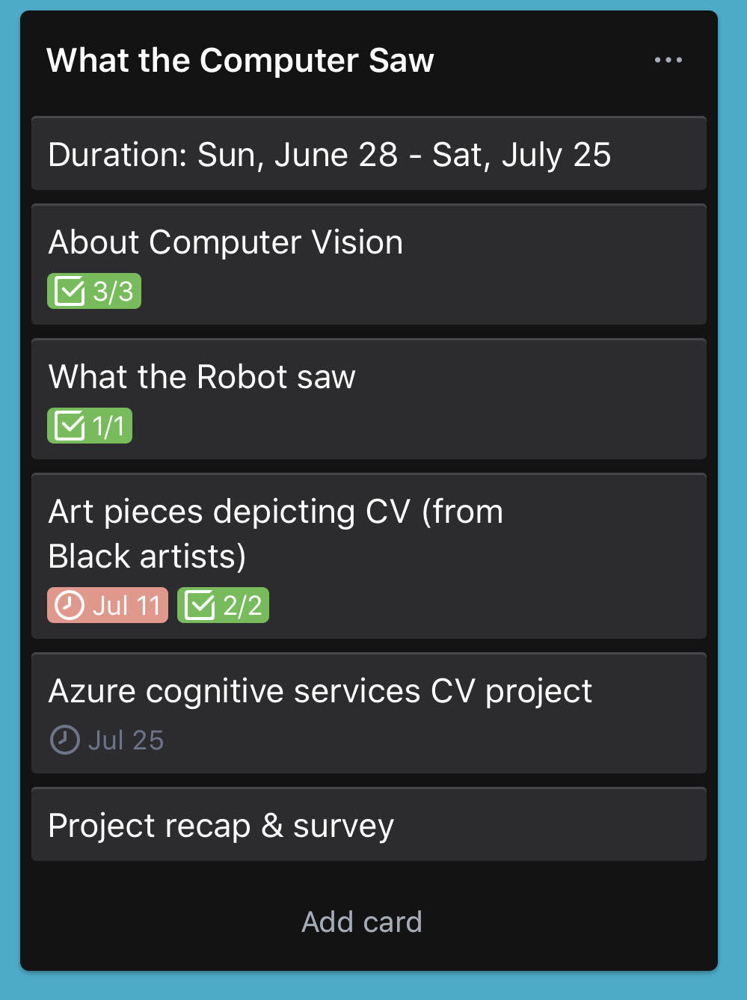

# What The Computer Saw
 
 # Overview
This is a personal project. 

I am currently learning Python and I just completed the [Getting started with Python](https://github.com/microsoft/c9-python-getting-started). 

One of the modules is on APIs and the example we covered was the Computer Vision API on Azure Cognitive Services. I decided to explore this API a bit more using the [Analyze method](https://westcentralus.dev.cognitive.microsoft.com/docs/services/5adf991815e1060e6355ad44/operations/56f91f2e778daf14a499e1fa). 

# Goal
- To explore what the capabilities of the CV API using Visual Studio Code and Python
- To observe and draw conclusions from the results derived from the images the algorithm processes, by highlighting it's strengths and flaws in relation to the confidence scores
- Gain relevant CV development skills in image analysis and object detection

# My approach
## Developed a project outline
I used Trello to plan out my project between June 28th and July 25th.



## Creating an Azure account
To start off, I went ahead and created an Azure account using my school email. This is needed to work with Cognitive Services because you need a key and an endpoint to connect with the API.

## Modifying the code
I build my code on top of the code provided on the [Getting started with Python](https://github.com/microsoft/c9-python-getting-started) API code. I created an application that: 
1. analyzes the image
2. prints out what the computer sees in terms of the image text caption
3. converts the confidence score to percentages
4. displays all the image tags

```
print("This computer sees " + results['description']['captions'][0]['text'])
confidence_score = float(results['description']['captions'][0]['confidence'])
print("Confidence score is: "+ str(round(confidence_score*100, 3))+"%")
print("The image tags are: " + ", ".join([str(item) for item in results['description']['tags']]))

```


## Collecting the data
I asked my audience on my munoxtech [Instagram](www.instagram.com/munoxtech) and [Twitter](www.twitter.com/munoxtech) ! Specifically seeking #BlackinTech folks.

This was my instructions:
> For this project in particular the only data I need from you (if you wanna participate) is a photo of yourself. I’m highlighting Black students in STEM through a CV algorithm. 
> The idea is that the pic runs through an algorithm that describes the pic and outputs « this is what an x looks like » you’d tell me what you want the  x to be. 
> Example: for me it could be, “this is what an electrical engineer looks like”

I tried to integrate the output of "this is what an *x* looks like" into the code but it was beyond the scope of my abilities so I decided to just type it out on the digital flyer.


## Running the API on the images retrieved
After collecting some pictures, I began to run them through my application and noting things down. I decided to feature the confidence scores with the image caption because it offers a bit of a humorous effect highlighting the faulty vision that computers have sometimes!

For example, for my photo, somehow it identified "wedding" as a tag... with zero-to-no correlation other than the fact that I was wearing a white top.

## Presentation design
After gathering all the data, I used cana for the graphics. I drew out some of the tags on the photo and wrote out words that just did not really corelate/ were indeed relevant to the pic. 


--------------------------------------

For more info, visit [munoxtech](https://www.instagram.com/p/CCM3f-fnRKy/?utm_source=ig_web_copy_link) on Instagram.

# References
[Microsoft Calling APIs module](https://github.com/microsoft/c9-python-getting-started/blob/master/python-for-beginners/16%20-%20Calling%20APIs/call_api.py)
